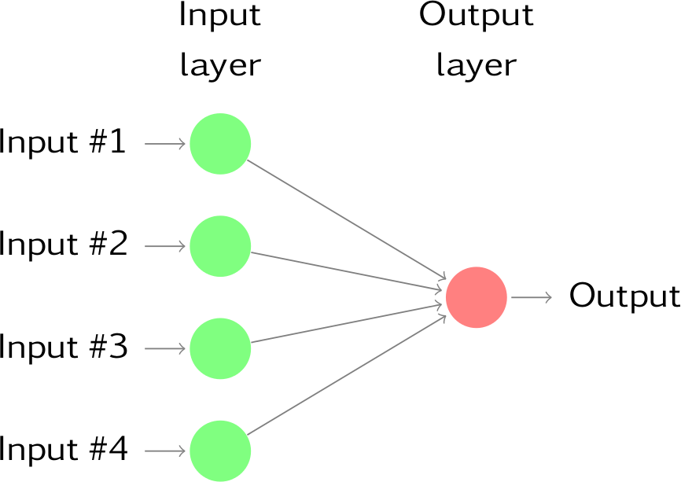

#Advanced forecasting methods {#advanced}

In this chapter, we briefly discuss four more advanced forecasting methods that build on the models discussed in earlier chapters.

## Complex seasonality {#complexseasonality}

So far, we have considered relatively simple seasonal patterns such as quarterly and monthly data. However, higher frequency data often exhibits more complicated seasonal patterns. For example, daily data may have a weekly pattern as well as an annual pattern.  Hourly data usually has three types of seasonality: a daily pattern, a weekly pattern, and an annual pattern. Even weekly data can be difficult as it typically has an annual pattern with seasonal period of $365.25/7\approx 52.179$ on average.

Such multiple seasonal patterns are becoming more common with high frequency data recording. Further examples where multiple seasonal patterns can occur include call volume in call centres, daily hospital admissions, requests for cash at ATMs, electricity and water usage, and access to computer web sites.

Most of the methods we have considered so far are unable to deal with these seasonal complexities. Even the `ts` class in R can only handle one type of seasonality, which is usually assumed to take integer values.

To deal with such series, we will use the `msts` class which handles multiple seasonality time series. Then you can specify all of the frequencies that might be relevant. It is also flexible enough to handle non-integer frequencies.

You won't necessarily want to include all of these frequencies --- just the ones that are likely to be present in the data. For example, if you have only 180 days of data, you can probably ignore the annual seasonality. If the data are measurements of a natural phenomenon (e.g., temperature), you might also be able to ignore the weekly seasonality.

Figure \@ref(fig:calls) shows the number of retail banking call arrivals per 5-minute interval between 7:00am and 9:05pm each weekday over a 33 week period.  There is a strong daily seasonal pattern with frequency 169, and a weak weekly seasonal pattern with frequency $169 \times 5=845$. (Call volumes on Mondays tend to be higher than the rest of the week.) If a longer series of data were available, there may also be an annual seasonal pattern.

```{r calls, echo=TRUE, fig.cap="Five-minute call volume handled on weekdays between 7am and 9:05pm in a large North American commercial bank. Top panel shows data from 3 March 2003 to 23 May 2003. Bottom panel shows only the first three weeks.", message=FALSE, warning=FALSE}
p1 <- autoplot(calls) +
  ylab("Call volume") + xlab("Weeks") +
  scale_x_continuous(breaks=seq(1,33,by=2))
p2 <- autoplot(window(calls, end=4)) +
  ylab("Call volume") + xlab("Weeks") +
  scale_x_continuous(minor_breaks = seq(1,4,by=0.2))
gridExtra::grid.arrange(p1,p2)
```

### STL with multiple seasonal periods {-}

The `mstl()` function is a variation on `stl()` designed to deal with multiple seasonality. It will return multiple seasonal components, as well as a trend and remainder component. 

```{r callsmstl, fig.cap="Multiple STL for the call volume data."}
calls %>%
  mstl() %>%
  autoplot()
```

### Dynamic harmonic regression with multiple seasonal periods {-}

With multiple seasonalities, we can use Fourier terms as we did in earlier chapters. Because there are multiple seasonalities, we need to add Fourier terms for each seasonal period. In this case, the seasonal periods are 169 and 845, so the Fourier terms are of the form
$$
  \sin\left(\frac{2\pi kt}{169}\right), \qquad
  \cos\left(\frac{2\pi kt}{169}\right), \qquad
  \sin\left(\frac{2\pi kt}{845}\right), \qquad  \text{and}
  \cos\left(\frac{2\pi kt}{845}\right),
$$
for $k=1,2,\dots$. The `fourier` function can generate these for you.

We will fit a dynamic regression model with an ARMA error structure. The total number of Fourier terms for each seasonal period have been chosen to minimize the AICc. We will use a log transformation (`lambda=0`) to ensure the forecasts and prediction intervals remain positive.

```{r callsharmonics, echo=TRUE}
fit <- auto.arima(calls, seasonal=FALSE, lambda=0,
         xreg=fourier(calls, K=c(10,10)))
fc <- forecast(fit, xreg=fourier(calls, K=c(10,10), h=2*169))
autoplot(fc, include=5*169) +
  ylab("Call volume") + xlab("Weeks")
```

This is a very large model, containing `r length(coef(fit))` parameters.

### TBATS models {-}

An alternative approach developed by @DHS11 uses a combination of Fourier terms with an exponential smoothing state space model and a Box-Cox transformation, in a completed automated manner. As with any automated modelling framework, it does not always work, but it can be a useful approach in some circumstances.

A TBATS model differs from dynamic harmonic regression in that the seasonality is allowed to change slowly over time in a TBATS model, while harmonic regression terms force the seasonal patterns to repeat periodically without changing. One drawback of TBATS models is that they can be very slow to estimate, especially with long time series. So we will consider a subset of the `calls` data to save time.

```{r callstbats, echo=TRUE, cache=TRUE}
calls %>%
  subset(start=length(calls)-2000) %>%
  tbats -> fit2
fc2 <- forecast(fit2, h=2*169)
autoplot(fc2, include=5*169) +
  ylab("Call volume") + xlab("Weeks")
```

Here the prediction intervals appear to be much too wide -- something that seems to happen quite often with TBATS models unfortunately.

### Complex seasonality with covariates {-}

TBATS models do not allow for covariates, although they can be included in dynamic harmonic regression models. One common application of such models is electricity demand modelling.

Figure \@ref(fig:elecdemand) shows half-hourly electricity demand in Victoria, Australia, during 2014, along with temperatures in the same period.

```{r elecdemand, cache=TRUE, echo=TRUE, fig.cap="Half-hourly electricity demand and corresponding temperatures in 2014, Victoria, Australia."}
autoplot(elecdemand[,c("Demand","Temperature")], facet=TRUE) +
  scale_x_continuous(minor_breaks=NULL,
    breaks=2014+cumsum(c(0,31,28,31,30,31,30,31,31,30,31,30))/365,
    labels=month.abb) +
  xlab("Time") + ylab("")
```

Plotting electricity demand against temperature shows that there is a nonlinear relationship between the two, with demand increasing for low temperatures (due to heating) and increasing for high temperatures (due to cooling).

```{r elecdemand2, cache=TRUE, echo=TRUE, fig.cap=""}
elecdemand %>%
  as.data.frame %>%
  ggplot(aes(x=Temperature, y=Demand)) + geom_point() +
    xlab("Temperature (degrees Celsius)") +
    ylab("Demand (GW)")
```

We will fit a regression model with a piecewise linear function of temperature (containing a knot at 18 degrees), and harmonic regression terms to allow for the daily seasonal pattern.

```{r elecdemand3, cache=TRUE, echo=TRUE, fig.cap=""}
cooling <- pmax(elecdemand[,"Temperature"], 18)
fit <- auto.arima(elecdemand[,"Demand"],
         xreg = cbind(fourier(elecdemand, c(10,10,0)),
               heating=elecdemand[,"Temperature"],
               cooling=cooling))
```

Forecasting with such models is difficult because we require future values of the predictor variables. Future values of the Fourier terms are easy to compute, but future temperatures are, of course, unknown. We could use temperature forecasts obtain from a meteorological model if we are only interested in forecasting up to a week ahead. Alternatively, we could use scenario forecasting and plug in possible temperature patterns. In the following example, we have used a repeat of the last two days of temperatures to generate future possible demand values.

```{r elecdemand4, cache=TRUE, echo=TRUE}
temps <- subset(elecdemand[,"Temperature"], start=NROW(elecdemand)-2*48+1)
fc <- forecast(fit, xreg=cbind(fourier(temps, c(10,10,0)),
                           heating=temps, cooling=pmax(temps,18)))
autoplot(fc, include=14*48)
```

Although the short-term forecasts look reasonable, this is a very crude model for a complicated process. The residuals demonstrate that there is a lot of information that has not been captured with this model.


```{r elecdemand5, cache=TRUE, echo=TRUE}
checkresiduals(fc)
```

More sophisticated versions of this model which provide much better forecasts are described in @HF2010 and @FH2012.

## Vector autoregressions {#VAR}

One limitation with the models we have considered so far is that they impose a unidirectional relationship --- the forecast variable is influenced by the predictor variables, but not vice versa. However, there are many cases where the reverse should also be allowed for --- where all variables affect each other. In Section \@ref(regarima), the changes in personal consumption expenditure ($C_t$) were forecast based on the changes in personal disposable income ($I_t$). However, in this case a bi-directional relationship may be more suitable: an increase in $I_t$ will lead to an increase in $C_t$ and vice versa.

An example of such a situation occurred in Australia during the Global Financial Crisis of 2008--2009. The Australian government issued stimulus packages that included cash payments in December 2008, just in time for Christmas spending. As a result, retailers reported strong sales and the economy was stimulated. Consequently, incomes increased.

Such feedback relationships are allowed for in the vector autoregressive (VAR) framework. In this framework, all variables are treated symmetrically. They are all modelled as if they influence each other equally. In more formal terminology, all variables are now treated as "endogenous". To signify this we now change the notation and write all variables as $y$s: $y_{1,t}$ denotes the $t$th observation of variable $y_1$, $y_{2,t}$ denotes the $t$th observation of variable $y_2$, and so on.

A VAR model is a generalisation of the univariate autoregressive model for forecasting a vector of time series.^[A more flexible generalisation would be a Vector ARMA process. However, the relative simplicity of VARs has led to their dominance in forecasting. Interested readers may refer to @AthEtAl2012.] It comprises one equation per variable in the system. The right hand side of each equation includes a constant and lags of all the variables in the system. To keep it simple, we will consider a two variable VAR with one lag. We write a 2-dimensional VAR(1) as
\begin{align}
\label{var1a}
  y_{1,t} &= c_1+\phi _{11,1}y_{1,t-1}+\phi _{12,1}y_{2,t-1}+e_{1,t} (\#eq:var1a)\\
  y_{2,t} &= c_2+\phi _{21,1}y_{1,t-1}+\phi _{22,1}y_{2,t-1}+e_{2,t} (\#eq:var1b)
\end{align}
where $e_{1,t}$ and $e_{2,t}$ are white noise processes that may be contemporaneously correlated. Coefficient $\phi_{ii,\ell}$ captures the influence of the $\ell$th lag of variable $y_i$ on itself, while coefficient $\phi_{ij,\ell}$ captures the influence of the $\ell$th lag of variable $y_j$ on $y_i$.

If the series are stationary, we forecast them by directly fitting a VAR to the data (known as a "VAR in levels"). If the series are non-stationary, we take differences to make them stationary, and then we fit a VAR model (known as a "VAR in differences"). In both cases, the models are estimated equation by equation using the principle of least squares. For each equation, the parameters are estimated by minimising the sum of squared $e_{i,t}$ values.

The other possibility, which is beyond the scope of this book (and therefore we do not explore here), is that the series may be non-stationary but cointegrated, which means that there exists a linear combination of them that is stationary. In this case a VAR specification that includes an error correction mechanism (usually referred to as a vector error correction model) should be included, and alternative estimation methods to least squares estimation should be used.^[Interested readers should refer to @Ham1994 and @Lut2007.]

Forecasts are generated from a VAR in a recursive manner. The VAR generates forecasts for *each* variable included in the system. To illustrate the process, assume that we have fitted the 2-dimensional VAR(1) described in equations \@ref(eq:var1a)--\@ref(eq:var1b), for all observations up to time $T$. Then the one-step-ahead forecasts are generated by
\begin{align*}
  \hat y_{1,T+1|T} &=\hat{c}_1+\hat\phi_{11,1}y_{1,T}+\hat\phi_{12,1}y_{2,T} \\
  \hat y_{2,T+1|T} &=\hat{c}_2+\hat\phi _{21,1}y_{1,T}+\hat\phi_{22,1}y_{2,T}.
\end{align*}

This is the same form as \@ref(eq:var1a)--\@ref(eq:var1b), except that the errors have been set to zero and parameters have been replaced with their estimates. For $h=2$, the forecasts are given by
\begin{align*}
  \hat y_{1,T+2|T} &=\hat{c}_1+\hat\phi_{11,1}\hat y_{1,T+1}+\hat\phi_{12,1}\hat y_{2,T+1}\\
  \hat y_{2,T+2|T}&=\hat{c}_2+\hat\phi_{21,1}\hat y_{1,T+1}+\hat\phi_{22,1}\hat y_{2,T+1}.
\end{align*}
Again, this is the same form as \@ref(eq:var1a)--\@ref(eq:var1b), except that the errors have been set to zero, parameters have been replaced with their estimates, and the unknown values of $y_1$ and $y_2$ have been replaced with their forecasts. The process can be iterated in this manner for all future time periods.

There are two decisions one has to make when using a VAR to forecast. They are: how many variables (denoted by $K$) and how many lags (denoted by $p$) should be included in the system. The number of coefficients to be estimated in a VAR is equal to $K+pK^2$ (or $1+pK$ per equation). For example, for a VAR with $K=5$ variables and $p=3$ lags, there are 16 coefficients per equation making for a total of 80 coefficients to be estimated. The more coefficients to be estimated, the larger the estimation error entering the forecast.

In practice, it is usual to keep $K$ small and include only variables that are correlated to each other (and therefore useful in forecasting each other). Information criteria are commonly used to select the number of lags to be included.

VAR models are implemented in the **vars** package in R. It contains a function `VARselect` to choose the number of lags $p$ using four different information criteria: AIC, HQ, SC and FPE. We have met the AIC before, and SC is simply another name for the BIC (SC stands for Schwarz Criterion after Gideon Schwarz who proposed it). HQ is the Hannan-Quinn criterion and FPE is the "Final Prediction Error" criterion.^[For a detailed comparison of these criteria, see Chapter 4.3 of @Lut2005.] Care should be taken using the AIC as it tends to choose large numbers of lags. Instead, for VAR models, we prefer to use the BIC.

A criticism VARs face is that they are atheoretical; that is, they are not built on some economic theory that imposes a theoretical structure to the equations. Every variable is assumed to influence every other variable in the system, which makes direct interpretation of the estimated coefficients very difficult. Despite this, VARs are useful in several contexts:

  * forecasting a collection of related variables where no explicit interpretation is required;
  * testing whether one variable is useful in forecasting another (the basis of Granger causality tests);
  * impulse response analysis, where the response of one variable to a sudden but temporary change in another variable is analysed;
  * forecast error variance decomposition, where the proportion of the forecast variance of one variable is attributed to the effect of other variables.

###Example: A VAR model for forecasting US consumption {-}

```{r varselect}
library(vars)
VARselect(uschange[,1:2], lag.max=8, type="const")[["selection"]]
```

The R output shows the lag length selected by each of the information criteria available in the **vars** package. There is a large discrepancy between a VAR(5) selected by the AIC and a VAR(1) selected by the BIC. This is not unusual. As a result we first fit a VAR(1), selected by the BIC. 

```{r varfit}
var <- VAR(uschange[,1:2], p=3, type="const")
summary(var)
serial.test(var, lags.pt=10, type="PT.asymptotic")
```

In similar fashion to the univariate ARIMA methodology we test that the residuals are uncorrelated using a Portmanteau test^[The tests for serial correlation in the "vars" package are multivariate generalisations of the tests presented in Section \@ref(residuals).]. The null hypothesis of no serial correlation in the residuals is rejected for both a VAR(1) and a VAR(2) and therefore we fit a VAR(3) as now the null is not rejected. The forecasts generated by the VAR(3) are plotted in Figure \@ref(fig:VAR3).

```{r VAR3, fig.cap="Forecasts for US consumption and income generated from a VAR(3).", cache=TRUE}
forecast(var) %>%
  autoplot() + xlab("Year")
```

## Neural network models {#nnetar}

Artificial neural networks are forecasting methods that are based on simple mathematical models of the brain. They allow complex nonlinear relationships between the response variable and its predictors.

### Neural network architecture {-}

A neural network can be thought of as a network of "neurons" organised in layers. The predictors (or inputs) form the bottom layer, and the forecasts (or outputs) form the top layer. There may be intermediate layers containing "hidden neurons".

The very simplest networks contain no hidden layers and are equivalent to linear regression. Figure \@ref(fig:nnet1) shows the neural network version of a linear regression with four predictors. The coefficients attached to these predictors are called "weights". The forecasts are obtained by a linear combination of the inputs. The weights are selected in the neural network framework using a "learning algorithm" that minimises a "cost function" such as MSE. Of course, in this simple example, we can use linear regression which is a much more efficient method for training the model.

```{r nnet1, fig.cap=" A simple neural network equivalent to a linear regression.", echo=FALSE, out.width="65%"}

```

Once we add an intermediate layer with hidden neurons, the neural network becomes non-linear. A simple example is shown in Figure \@ref(fig:nnet2).

```{r nnet2, fig.cap="A neural network with four inputs and one hidden layer with three hidden neurons.", echo=FALSE}
knitr::include_graphics("nnet2.png")
```

This is known as a *multilayer feed-forward network* where each layer of nodes receives inputs from the previous layers. The outputs of nodes in one layer are inputs to the next layer. The inputs to each node are combined using a weighted linear combination. The result is then modified by a nonlinear function before being output. For example, the inputs into hidden neuron $j$ in Figure \@ref(fig:nnet1) are linearly combined to give
$$
  z_j = b_j + \sum_{i=1}^4 w_{i,j} x_i.
$$
In the hidden layer, this is then modified using a nonlinear function such as a sigmoid,
$$
  s(z) = \frac{1}{1+e^{-z}},
$$
to give the input for the next layer. This tends to reduce the effect of extreme input values, thus making the network somewhat robust to outliers.

The parameters $b_1,b_2,b_3$ and $w_{1,1},\dots,w_{4,3}$ are "learned" from the data. The values of the weights are often restricted to prevent them becoming too large. The parameter that restricts the weights is known as the "decay parameter" and is often set to be equal to 0.1.

The weights take random values to begin with, which are then updated using the observed data. Consequently, there is an element of randomness in the predictions produced by a neural network. Therefore, the network is usually trained several times using different random starting points, and the results are averaged.

The number of hidden layers, and the number of nodes in each hidden layer, must be specified in advance. We will consider how these can be chosen using cross-validation later in this chapter.

### Neural network autoregression {-}

With time series data, lagged values of the time series can be used as inputs to a neural network, just as we used lagged values in a linear autoregression model (Chapter \@ref(arima)). We call this a neural network autoregression or NNAR model.

In this book, we only consider feed-forward networks with one hidden layer, and use the notation NNAR($p,k$) to indicate there are $p$ lagged inputs and $k$ nodes in the hidden layer. For example, a NNAR(9,5) model is a neural network with the last nine observations $(y_{t-1},y_{t-2},\dots,y_{t-9}$) used as inputs to forecast the output $y_t$, and with five neurons in the hidden layer. A NNAR($p,0$) model is equivalent to an ARIMA($p,0,0$) model but without the restrictions on the parameters to ensure stationarity.

With seasonal data, it is useful to also add the last observed values from the same season as inputs. For example, an NNAR(3,1,2)$_{12}$ model has inputs $y_{t-1}$, $y_{t-2}$, $y_{t-3}$ and $y_{t-12}$, and two neurons in the hidden layer. More generally, an NNAR($p,P,k$)$_m$ model has inputs $(y_{t-1},y_{t-2},\dots,y_{t-p},y_{t-m},y_{t-2m},y_{t-Pm})$ and $k$ neurons in the hidden layer. A NNAR($p,P,0$)$_m$ model is equivalent to an ARIMA($p,0,0$)($P$,0,0)$_m$ model but without the restrictions on the parameters to ensure stationarity.

The `nnetar()` function fits an NNAR($p,P,k$)$_m$ model. If the values of $p$ and $P$ are not specified, they are automatically selected. For non-seasonal time series, the default is the optimal number of lags (according to the AIC) for a linear AR($p$) model. For seasonal time series, the default values are $P=1$ and $p$ is chosen from the optimal linear model fitted to the seasonally adjusted data. If $k$ is not specified, it is set to $k=(p+P+1)/2$ (rounded to the nearest integer).

### Example: sunspots {-}

The surface of the sun contains magnetic regions that appear
as dark spots. These affect the propagation of radio waves and so
telecommunication companies like to predict sunspot activity in order to
plan for any future difficulties. Sunspots follow a cycle of length
between 9 and 14 years. In Figure \@ref(fig:sunspotnnetar), forecasts
from an NNAR(10,6) are shown for the next 30 years. We have set a Box-Cox transformation with `lambda=0` to ensure the forecasts stay positive.

```{r sunspotnnetar, fig.cap="Forecasts from a neural network with ten lagged inputs and one hidden layer containing six neurons.", cache=TRUE}
fit <- nnetar(sunspotarea, lambda=0)
autoplot(forecast(fit,h=30))
```

Here, the last 10 observations are used as predictors, and there are 6 neurons in the hidden layer. The cyclicity in the data has been modelled well. We can also see the asymmetry of the cycles has been captured by the model, where the increasing part of the cycle is steeper than the decreasing part of the model. This is one difference between a NNAR model and a linear AR model --- while linear AR models can model cyclicity, the modelled cycles are always symmetric.

### Prediction intervals {-}

Unlike most of the methods considered in this book, neural networks are not based on a well-defined stochastic model, and so it is not straightforward to derive prediction intervals for the resultant forecasts. However, we can still do it using simulation where future sample paths are generated using bootstrapped residuals.

The model can be written as
$$
  y_t = f(\boldsymbol{y}_{t-1}) + \varepsilon_t
$$
where $\boldsymbol{y}_{t-1} = (y_{t-1},y_{t-2},\dots,y_{t-8})'$ is a vector containing lagged values of the series, and $f$ is a neural network with 4 hidden nodes in a single layer.

The error series $\{\varepsilon_t\}$ is assumed to be homoscedastic (and possibly also normally distributed).

We can simulate future sample paths of this model iteratively, by randomly generating a value for $\varepsilon_t$, either from a normal distribution, or by resampling from the historical values. So if $\varepsilon^*_{T+1}$ is a random draw from the distribution of errors at time $T+1$, then
$$
  y^*_{T+1} = f(\boldsymbol{y}_{T}) + \varepsilon^*_{T+1}
$$
is one possible draw from the forecast distribution for $y_{T+1}$. Setting 
$\boldsymbol{y}_{T+1}^* = (y^*_{T+1}, y_{T}, \dots, y_{T-6})'$, we can then repeat the process to get
$$
  y^*_{T+2} = f(\boldsymbol{y}^*_{T+1}) + \varepsilon^*_{T+2}.
$$
In this way, we can iteratively simulate a future sample path. By repeatedly simulating sample paths, we build up knowledge of the distribution for all future values based on the fitted neural network. 

Here is a simulation of 9 possible future sample paths for the sunspot data. Each sample path covers the next 30 years after the observed data.


```{r nnetarsim, message=FALSE}
sim <- ts(matrix(0, nrow=30L, ncol=9L), start=end(sunspotarea)[1L]+1L)
for(i in seq(9))
  sim[,i] <- simulate(fit, nsim=30L)
autoplot(sunspotarea) + forecast::autolayer(sim)
```

If we do this a few hundred or thousand times, we can get a very good picture of the forecast distributions. This is how the `forecast.nnetar` function produces prediction intervals:

```{r nnetarsunspotf, dependson="sunspotnnetar"}
fcast <- forecast(fit, PI=TRUE, h=30)
autoplot(fcast)
```

Because it is a little slow, `PI=FALSE` is the default, so prediction intervals are not computed unless requested. The `npaths` argument in `forecast.nnetar` controls how many simulations are done (default 1000). By default, the errors are drawn from a normal distribution. The `bootstrap` argument allows the errors to be "bootstrapped" (i.e., randomly drawn from the historical errors). 


## Bootstrapping and bagging {#bootstrap}

### Bootstrapping time series {-}

In Section \@ref(prediction-intervals), we described how to bootstrap the residuals of a time series in order to simulate future values of a series using a model.

More generally, we can generate new time series that are similar to our observed series, using another type of bootstrap.

First, the time series is Box-Cox-transformed, and then decomposed into trend, seasonal and remainder components using STL. Then we obtain shuffled versions of the remainder component to get bootstrapped remainder series. Because there may be autocorrelation present in an STL remainder series, we cannot simply use the re-draw procedure that was described in Section \@ref(prediction-intervals). Instead, we use a "blocked bootstrap", where contiguous sections of the time series are selected at random and joined together. These bootstrapped remainder series are added to the trend and seasonal components, and the Box-Cox transformation is reversed to give variations on the original time series. 

Some examples are shown below for the monthly expenditure on retail debit cards in Iceland, from January 2000 to August 2013.

```{r stlbookts, message=FALSE, warning=FALSE, fig.cap="Ten bootstrapped versions of quarterly Australian tourist arrivals."}
bootseries <- bld.mbb.bootstrap(debitcards, 10) %>%
  as.data.frame %>% ts(start=2000, frequency=12)
autoplot(debitcards) +
  forecast::autolayer(bootseries, colour=TRUE) +
  forecast::autolayer(debitcards, colour=FALSE) +
  ylab("Bootstrapped series") + guides(colour="none")
```

This type of bootstrapping can be useful in two ways. First it helps us to get a better measure of forecast uncertainty, and second it provides a way of improving our point forecasts using "bagging".

### Prediction intervals from bootstrapped series {-}

Almost all prediction intervals from time series models are too narrow. This is a well-known phenomenon and arises because they do not account for all sources of uncertainty. In @HKSG02, we measured the size of the problem by computing the actual coverage percentage of the prediction intervals on test data. We found that for ETS models, nominal 95% intervals may only provide coverage between 71% and 87%. The difference is due to missing sources of uncertainty.

There are at least four sources of uncertainty in forecasting using time series models:

  1. The random error term;
  2. The parameter estimates;
  3. The choice of model for the historical data;
  4. The continuation of the historical data generating process into the future.

When we produce prediction intervals for time series models, we generally only take into account the first of these sources of uncertainty. Even if we ignore the model uncertainty and the uncertainty due to changing  data generating processes (sources 3 and 4), and we just try to allow for parameter uncertainty as well as the random error term (sources 1 and 2), there are no algebraic solutions apart from some simple special cases.

We can use bootstrapped time series to go some way towards overcoming this problem. We demonstrate the idea using the `debitcards` data. First, we simulate many time series that are similar to the original data, using the block-bootstrap described above.

```{r debitcardsim}
nsim <- 1000L
sim <- bld.mbb.bootstrap(debitcards, nsim)
```

For each of these series, we fit an ETS model and simulate one sample path from that model. A different ETS model may be selected in each case, although it will most likely select the same model because the series are very similar. However, the estimated parameters will be different. Therefore the simulated sample paths will allow for model uncertainty and parameter uncertainty, as well as the uncertainty associated with the random error term. Naturally, this takes a while as there are a large number of time series to model.

```{r debitcardboot, dependson="debitcardsim"}
h <- 36L
future <- matrix(0, nrow=nsim, ncol=h)
for(i in seq(nsim))
  future[i,] <- simulate(ets(sim[[i]]), nsim=h)
```

Finally, we take the means and quantiles of these simulated sample paths to form point forecasts and prediction intervals.

```{r debitcardfc, dependson='debitcardboot'}
start <- tsp(debitcards)[2]+1/12
simfc <- structure(list(
    mean = ts(colMeans(future), start=start, frequency=12),
    lower = ts(apply(future, 2, quantile, prob=0.025), 
               start=start, frequency=12),
    upper = ts(apply(future, 2, quantile, prob=0.975),
               start=start, frequency=12),
    level=95),
  class="forecast")
```

These prediction intervals will be larger than those obtained from an ETS model applied directly to the original data.

```{r debitcardscomparison, dependson='debitcardboot'}
etsfc <- forecast(ets(debitcards), h=h, level=95)
autoplot(debitcards) +
  ggtitle("Monthly retail debit card usage in Iceland") +
  xlab("Year") + ylab("million ISK") +
  forecast::autolayer(simfc, series="Simulated") +
  forecast::autolayer(etsfc, series="ETS")
```

### Bagged ETS forecasts {-}

Another use for these bootstrapped time series is to improve forecast accuracy. If we produce forecasts from each of the additional time series, and average the resulting forecasts, we get better forecasts than if we simply forecast the original time series directly. This is called "bagging" which stands for "**b**ootstrap **agg**regatin**g**". 

We could simply average the simulated future sample paths computed earlier. However, if our interest is only in improving point forecast accuracy, and not in also obtaining improved prediction intervals, then it is quicker to average the point forecasts from each series. The speed improvement comes about because we do not need to produce so many simulated series.

We will use `ets` to forecast each of these series. Figure \@ref(fig:baggedf) shows ten forecasts obtained in this way.

```{r baggedf, dependson="debitcardboot", fig.cap="Forecasts of the ten bootstrapped series obtained using ETS models.", message=FALSE, warning=FALSE}
sim <- bld.mbb.bootstrap(debitcards, 10) %>%
  as.data.frame() %>%
  ts(frequency=12, start=2000)
fc <- purrr::map(as.list(sim), 
           function(x){forecast(ets(x))$mean}) %>%
      as.data.frame() %>%
      ts(frequency=12, start=start)
autoplot(debitcards) +
  forecast::autolayer(sim, colour=TRUE) +
  forecast::autolayer(fc, colour=TRUE) +
  forecast::autolayer(debitcards, colour=FALSE) +
  ylab("Bootstrapped series") +
  guides(colour="none")
```

The average of these forecast gives the bagged forecasts of the original data. The whole procedure can be handled with the `baggedETS` function:

```{r baggedets, fig.cap="Comparing bagged ETS forecasts (the average of 100 bootstrapped forecast) and ETS applied directly to the data."}
etsfc <- debitcards %>% ets %>% forecast(h=36)
baggedfc <- debitcards %>% baggedETS %>% forecast(h=36)
autoplot(debitcards) +
  forecast::autolayer(baggedfc$mean, series="BaggedETS") +
  forecast::autolayer(etsfc$mean, series="ETS") +
  guides(colour=guide_legend(title="Forecasts"))
```

By default, 100 bootstrapped series are used, and the length of the blocks used for obtaining bootstrapped residuals is set to 24 for monthly data. 

In this case, it makes very little difference. @baggedETS show that, on average, it gives better forecasts than just applying `ets` directly. Of course, it is slower because a lot more computation is required.


## Exercises {#advanced-exercises}

1. Use the `tbats()` function to model your retail time series.
    a. Check the residuals and produce forecasts.
    b. Does this completely automated approach work for these data?
    c. Have you saved any degrees of freedom by using Fourier terms rather than seasonal differencing?

2. Consider the weekly data on US finished motor gasoline products supplied (thousands of barrels per day) (series `gasoline`):

    a. Fit a TBATS model to these data.
    b. Check the residuals and produce forecasts.
    c. Could you model these data using any of the other methods we have considered in this book?

3. Experiment with using `nnetar()` on your retail data and other data we have considered in previous chapters.

## Further reading {#advanced-reading}
